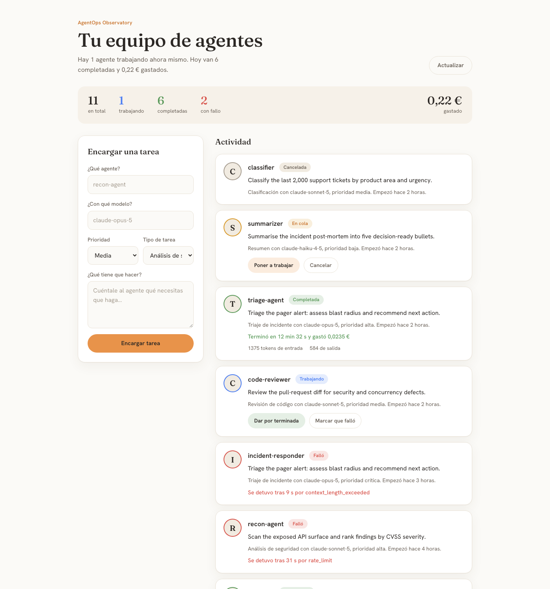
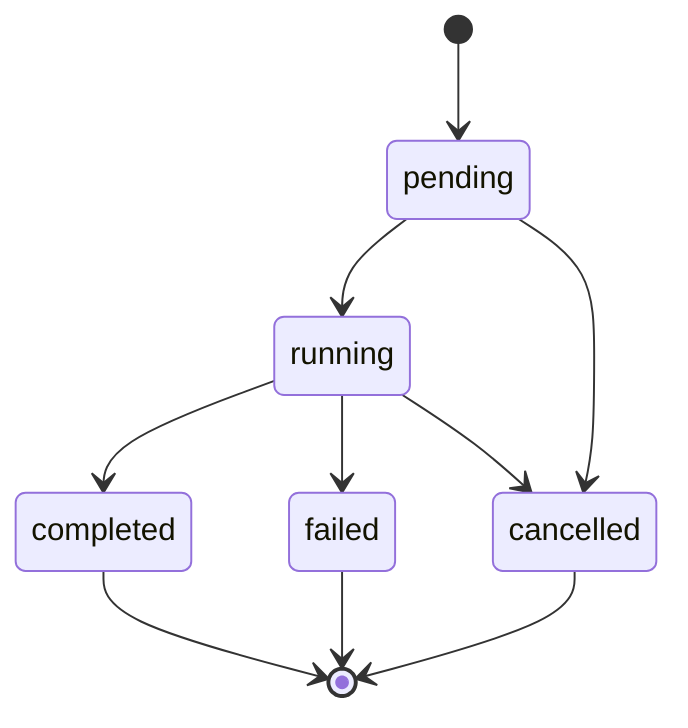

# AgentOps Observatory

A small full-stack dashboard to **track and observe AI agent executions** — their
lifecycle, cost and token usage. Built as a portfolio project to show an
end-to-end slice: a typed REST API with a server-enforced state machine on the
back, and a modern signal-based Angular dashboard on the front.



<p>
  
  
  
  
  
  
</p>

---

## What it does

Each **execution** represents one run of an AI agent: which agent, which model,
the task type, the priority and the instruction. The dashboard lets you:

- **Register** a new execution through a validated form.
- **Advance its lifecycle** — start it, complete it, fail it or cancel it — with
  the allowed transitions enforced on the server.
- **See live metrics** — total, in-progress, completed, failed and accumulated
  cost — recomputed reactively from the execution list.
- **Inspect metering** — input/output tokens and cost are recorded when a run
  completes; the failure reason is recorded when it fails.

### Execution lifecycle

The status transitions are enforced by the API — an illegal jump returns
`409 Conflict`, never a silently corrupted row.



---

## Architecture

A monorepo with two independent workspaces:

```
Bases/
├── backend/          FastAPI + SQLAlchemy REST API (SQLite)
│   ├── app/
│   │   ├── main.py            app wiring + CORS + health check
│   │   ├── api/executions.py  routes + status state machine
│   │   ├── models/            SQLAlchemy ORM model
│   │   ├── schemas/           Pydantic request/response contracts
│   │   └── db/                engine + session dependency
│   ├── tests/                 pytest suite (isolated in-memory DB)
│   └── seed.py                demo data loader
└── frontend/         Angular 22 dashboard (standalone, signals)
    └── src/app/
        ├── app.ts             root component (signals + computed metrics)
        ├── services/          typed HttpClient wrapper
        └── models/            shared TypeScript contracts
```

The frontend talks to the backend over plain REST (`http://127.0.0.1:8000`).
The backend persists to a local SQLite file (`agentops.db`), so there is no
database server to set up.

---

## Tech stack

| Layer     | Choices                                                                 |
| --------- | ----------------------------------------------------------------------- |
| Frontend  | Angular 22 (standalone components, signals, reactive forms), TypeScript |
| Backend   | FastAPI, Pydantic v2, SQLAlchemy 2.0 (typed `Mapped[...]` models)       |
| Database  | SQLite (file-based, zero-config)                                        |
| Testing   | pytest + Starlette `TestClient` (backend), Vitest (frontend)            |
| Tooling   | Prettier, Angular CLI, uvicorn                                          |

---

## Getting started

### 1. Backend

```bash
cd backend
python3 -m venv .venv
source .venv/bin/activate
pip install -r requirements.txt

python seed.py                       # optional: load demo executions
uvicorn app.main:app --reload        # http://127.0.0.1:8000
```

Interactive API docs are served at `http://127.0.0.1:8000/docs`.

### 2. Frontend

```bash
cd frontend
npm install
npm start                            # http://localhost:4200
```

Open `http://localhost:4200` with the backend running.

---

## API reference

Base URL: `http://127.0.0.1:8000`

| Method  | Endpoint                    | Description                                          |
| ------- | --------------------------- | ---------------------------------------------------- |
| `GET`   | `/health`                   | Service health check.                                |
| `POST`  | `/executions`               | Register a new execution (starts `pending`). `201`.  |
| `GET`   | `/executions`               | List every execution, newest first.                  |
| `GET`   | `/executions/{id}`          | Fetch a single execution. `404` if unknown.          |
| `PATCH` | `/executions/{id}/status`   | Advance the lifecycle. `409` on an illegal transition.|

On a transition to `completed`, the PATCH body may carry `input_tokens`,
`output_tokens` and `cost`; on a transition to `failed`, it may carry
`error_type` and `error_retryable`.

---

## Testing

Backend — 14 end-to-end tests covering routing, validation, persistence and the
status state machine (each runs against a throwaway in-memory database):

```bash
cd backend
pip install -r requirements-dev.txt
pytest
```

Frontend — component and service specs with Angular's `HttpTestingController`:

```bash
cd frontend
npm test
```

---

## Notes

- The token/cost figures shown when completing a run from the UI are **simulated
  metering** — there is no real LLM behind the dashboard. The API itself accepts
  and stores whatever metering the caller reports, so a real agent runner could
  post its actual usage.
- SQLite and the file-based schema keep the project runnable in seconds with no
  external services; swapping to PostgreSQL is a matter of changing the engine
  URL (the code already ships with `psycopg`).
